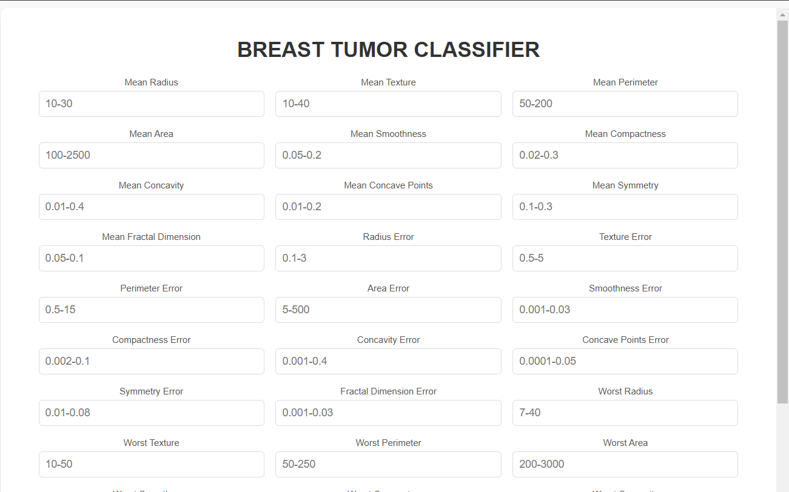
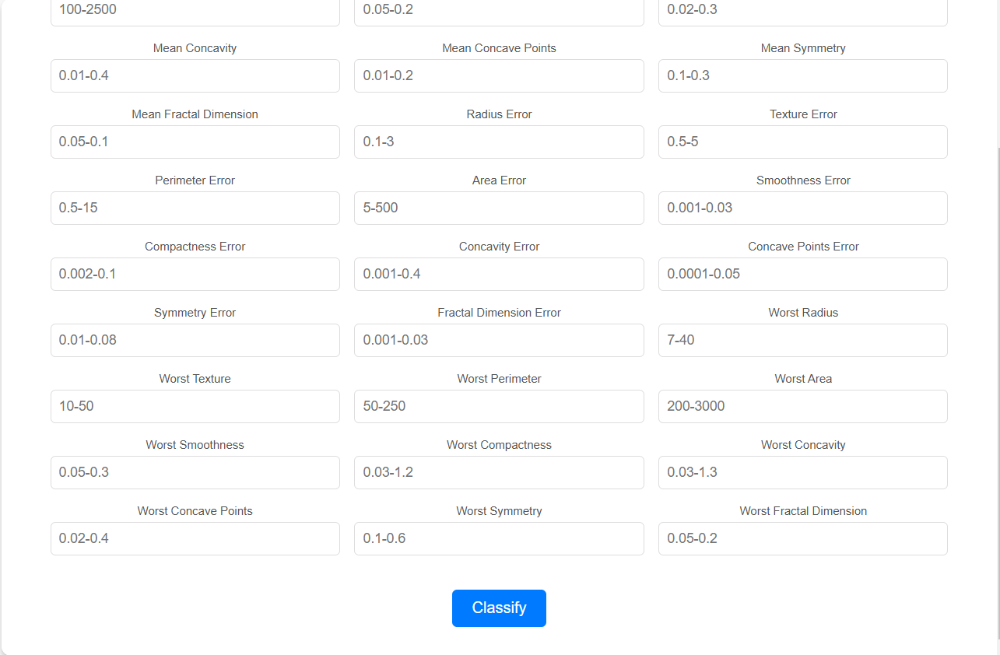

# Breast Tumor Classification Project

## Introduction
The **Breast Tumor Classification Project** is a machine learning application that classifies breast tumors as **malignant** or **benign** based on diagnostic measurements. This project utilizes the **RandomForestClassifier**, which is well-suited for classification tasks, achieving a high accuracy of **96.49%** on the test dataset.

The goal of this project is to assist medical professionals by providing a reliable, efficient, and interactive tool for early detection and diagnosis of breast cancer.

---

## Features
- **Random Forest Model**: Trained on diagnostic data to classify tumors as malignant or benign.
- **Data Preprocessing**: Scaling and splitting the dataset for robust training and testing.
- **Web Interface**: Flask-based interactive platform for real-time predictions.
- **User-Friendly Frontend**: HTML and CSS-based input form for user interaction.

---

## Data Analysis
1. **Dataset Exploration**:
   - Extracted diagnostic features like `mean radius`, `mean texture`, `mean smoothness`, etc., from the dataset.
   - Verified that there are no missing or invalid entries.
2. **Feature Scaling**:
   - Standardized all numerical features using `StandardScaler` to ensure they have a mean of 0 and standard deviation of 1.
3. **Train-Test Split**:
   - Divided the data into 80% training and 20% testing subsets.
4. **Saved Preprocessed Data**:
   - Stored the processed data as `.npy` files for easy reuse during model training and testing.

---

## Model Training
### Algorithm: RandomForestClassifier
- A **Random Forest** is an ensemble learning method that uses multiple decision trees to improve accuracy and reduce overfitting.
- **Hyperparameters**: Default settings were used for simplicity, but the model can be fine-tuned further.
- **Training Process**:
  - Trained on 80% of the dataset after preprocessing.
  - Saved the trained model as `model.pkl` using the `joblib` library.

### Evaluation
The model was evaluated on the test set (20% of the dataset), and the following metrics were obtained:

- **Accuracy**: 96.49%
- **Precision, Recall, and F1-Score**:

            precision    recall  f1-score   support

        0       0.96      0.99      0.97        71
        1       0.98      0.93      0.95        43

 accuracy                           0.96       114
macro avg       0.97      0.96      0.96       114

## Project Structure
breast-tumor-classification/ ├── data/ │ ├── breast-cancer.csv # Dataset 
│ ├── X_train.npy # Preprocessed training features 
│ ├── X_test.npy # Preprocessed testing features 
│ ├── y_train.npy # Training labels 
│ └── y_test.npy # Testing labels 
├── notebooks/ 
│ ├── data_analysis.ipynb # Jupyter Notebook for data analysis and preprocessing 
│ └── model_training.ipynb # Jupyter Notebook for training the Random Forest model 
├── backend/ │ ├── app.py # Flask backend for inference 
│ ├── model.pkl # Saved Random Forest model 
│ ├── templates/ 
│ │ └── index.html # HTML frontend form 
│ └── static/ 
│ └── style.css # CSS for styling the form 
└── README.md # Project documentation

---

## Screenshots of Web Application

### Input Form Pic1

### Input Form Pic2

---

## Usage Instructions

### 1. Clone the Repository
git clone <repository-url>
cd breast-tumor-classification

### 2. Install Dependencies
#### Install the required Python libraries using the following command:

pip install -r requirements.txt
### 3. Run the Web Application
#### Start the Flask server:

python backend/app.py
### Visit http://127.0.0.1:5000 in your browser to access the application.